# CICD pipeline on EC2

Level: Advanced

Duration: 120 minutes

**AWS Cloud9** is a cloud-based integrated development environment (IDE) that lets you write, run, and debug your code with just a browser.

**AWS CodeCommit** is a fully-managed source control service that hosts secure Git-based repositories.

**AWS CodePipeline** is a fully managed continuous delivery service that helps you automate your release pipelines for fast and reliable application and infrastructure updates.

CICD is the most important topic for developers after the website matures. In this tutorial, we will take you to create an EC2 CICD pipeline through AWS CICD service.

After completing this lab, we will learn:

* Use Cloud9 as IDE to develop the project
* Create CodeCommit as the code repository
* Use Codepipeline to integrate the CICD services
 
## Scenario

We will first create CodeCommit as a code repository, then open Cloud9 as an IDE to edit the flask app, and use CodeDeploy to deploy the code to EC2, and finally use CodePipeline to integrate the above-mentioned entire process into an automated pipeline.

> flask is a web framework.

<p style="text-align:center;">
    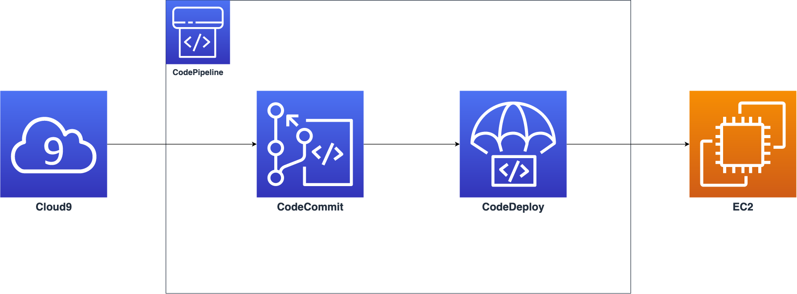
</p>

## Before You Start
* After you starting this lab, we start to provision your lab resources:
  * A **EC2 Instance** named `flask-app`
  * Two IAM Role:
    * **CodeDeployRoleForLab**
    * **CodePipelineRoleForLab**

* At the right of top, click the `Open Console` or `開啟 Console`, this would automatically log in to the AWS Management Console for you.

* Download [sample-flask-app.zip](./materials/sample-flask-app.zip), we will use it later.

### Confirm the Access Region
* The console will lead you to the region where the resources provisioned.
* Make sure your region is in `Oregon(us-west-2)`, or you would get the permission error.
* If you facing the permission error, kindly help to check the region you are as above.

### Common Login Errors

#### You must first log out

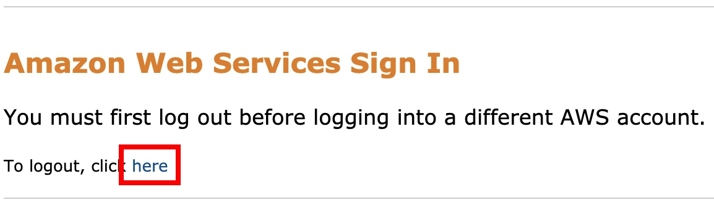

* This error would happen if your browser currently with alive AWS Credential.
* Click the button `here` to log out.
* Then go back to the eLearning window, and click `Open Console` or `開啟 Console` again.

## Task 1: Create Source Stage with CodeCommit

* On the service menu, select __[CodeCommit](https://us-west-2.console.aws.amazon.com/codesuite/codecommit/repositories/?region=us-west-2)__.

* Select __Create repository__ to create a new repo.

<p style="text-align:center;">
    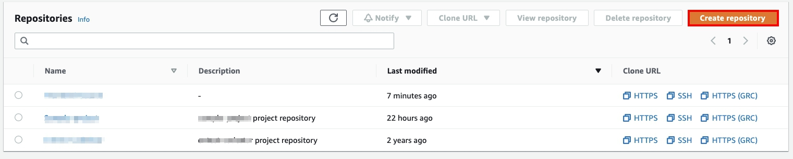
</p>

* Type `sample-flask-app` for the __Repository name__ and click __Create__.

* Select the __HTTPS(GRC)__ tab and copy the URL to clone the repository.

<p style="text-align:center;">
    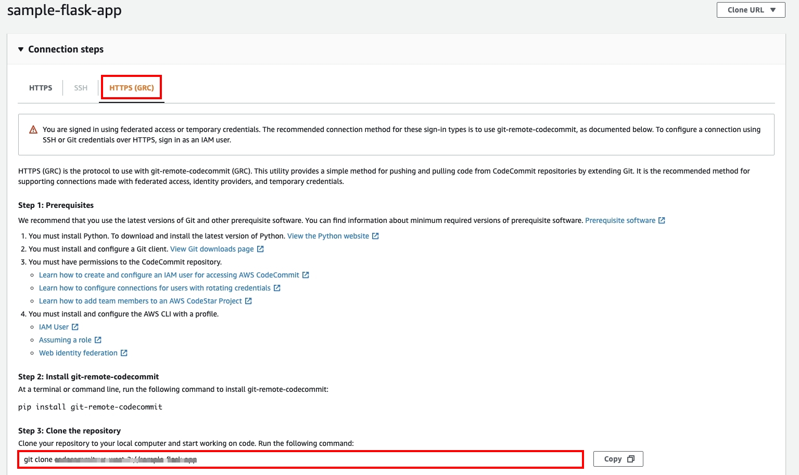
</p>

> It will looks like: `git clone codecommit::us-west-2://your-repo-name`

## Task 2: Prepare the Development Environment

* Open the [Cloud9](https://us-west-2.console.aws.amazon.com/cloud9/home?) console.

* Select __Create environment__:
    * For the __name__: `my-IDE`
    * Click __Next step__

* For the __Environment settings__:
    * __Environment type__: `Create a new EC2 instance for environment (direct access)`
    * __Instance type__: `Other instance type, t3.micro`
    * __Platform__: `Amazon Linux 2 (recommended)`
    * __Cost-saving setting__: `After 30 minutes (default)`

<p style="text-align:center;">
    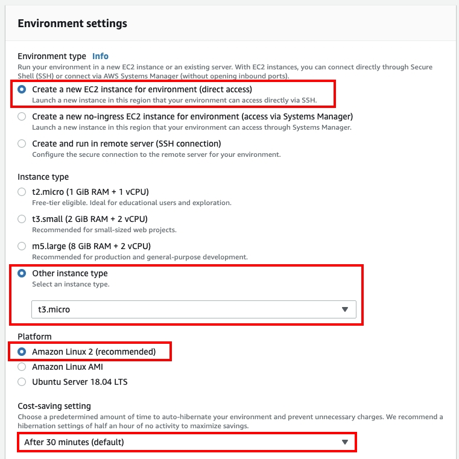
</p>

* Extend the **Network settings (advanced)**:
    * **Network (VPC)**: `Lab_VPC`
    * **Subnet**: `Lab VPC Public Subnet 1(us-west-2a)`

<p align="center">
    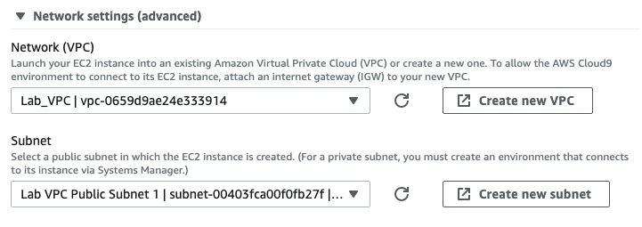
</p>

* Select __Create environment__ if there is nothing to change.

* You will be redirected to the Cloud9 page.

<p style="text-align:center;">
    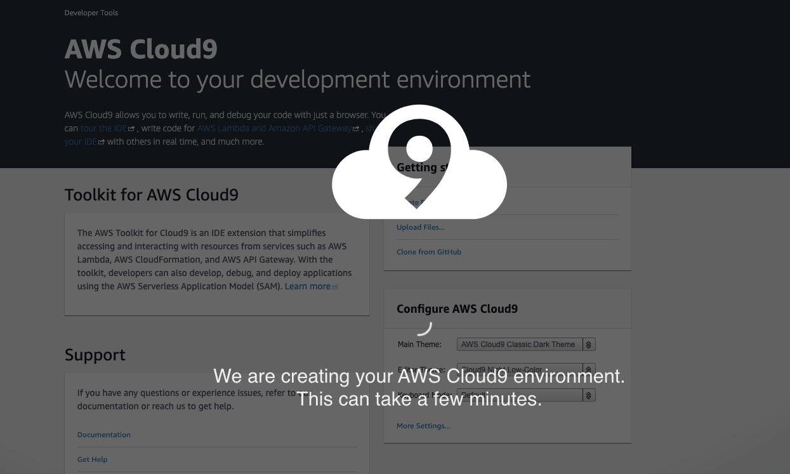
</p>

* You can see all the file structures on the left, the upper part is the code writing area, and the lower part is the terminal.

<p style="text-align:center;">
    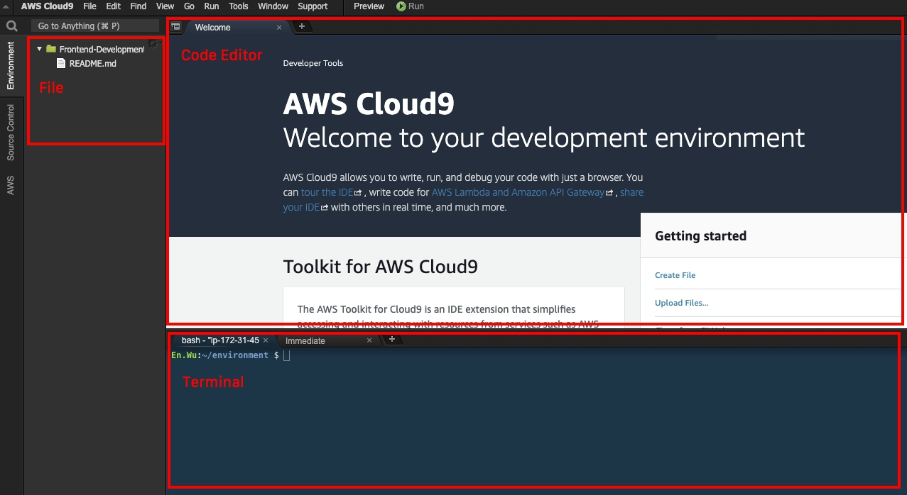
</p>

* Let's check the Python version, insert the following command in the terminal:

```bash
$ python3  --version

Python 3.7.10
```

* Install *git-remote-codecommit* with `pip install git-remote-codecommit` command to make sure have the ability to clone the repository in CodeCommit.

```bash
$ pip install git-remote-codecommit

Requirement already satisfied: git-remote-codecommit in /usr/local/lib/python3.7/site-packages
Requirement already satisfied: botocore>=1.17.0 in /usr/local/lib/python3.7/site-packages (from git-remote-codecommit)
Requirement already satisfied: jmespath<1.0.0,>=0.7.1 in /usr/local/lib/python3.7/site-packages (from botocore>=1.17.0->git-remote-codecommit)
Requirement already satisfied: python-dateutil<3.0.0,>=2.1 in /usr/local/lib/python3.7/site-packages (from botocore>=1.17.0->git-remote-codecommit)
Requirement already satisfied: urllib3<1.27,>=1.25.4 in /usr/local/lib/python3.7/site-packages (from botocore>=1.17.0->git-remote-codecommit)
Requirement already satisfied: six>=1.5 in /usr/local/lib/python3.7/site-packages (from python-dateutil<3.0.0,>=2.1->botocore>=1.17.0->git-remote-codecommit)
```

*  Run the command to clone your repository.

> Type the command that you copy in previous step.

```bash
$ git clone codecommit::us-east-1://<your-repo-name>

Cloning into 'sample-flask-app'...
warning: You appear to have cloned an empty repository.
```

* You will see the repo in the upper left panel.

<p style="text-align:center;">
    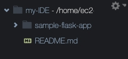
</p>

* Type `cd <your-repo-name>` to switch directory.

```bash
$ cd sample-flask-app/
```

* Upload the [sample-flask-app.zip](./materials/sample-flask-app.zip).

> *Make sure you are upload to the repo's directory.*

<p style="text-align:center;">
    
</p>

* Type the following command to unzip the folder.

```bash
$ unzip sample-flask-app.zip
```

* Type the following command to push the file:

```bash
$ git add .
 git commit -m "first commit"
 git push
```

* You will see the changes in [CodeCommit](https://us-west-2.console.aws.amazon.com/codesuite/codecommit/repositories/) Console.

<p style="text-align:center;">
    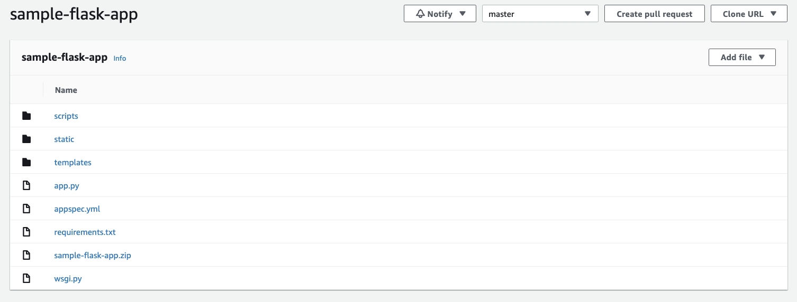
</p>

## Task 3: Create Deploy Stage with CodeDeploy

* Open the [CodeDeploy](https://us-west-2.console.aws.amazon.com/codesuite/codedeploy/applications?region=us-west-2) console.

* Select **Create application**.

* For the **Application configuration**:
  * **Application name**: `flask-app`
  * **Compute platform**: `EC2/On-premises`
  * **Create application**

* Select **Create deployment group**.

<p style="text-align:center;">
    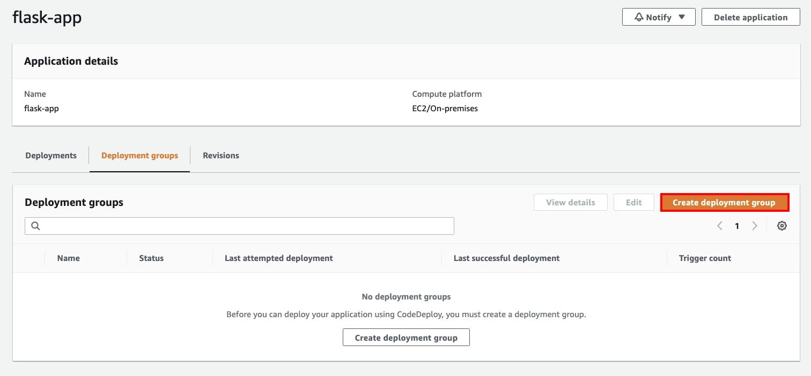
</p>

* For the **Deployment group name**: `flask-deployment-group`
* For the **Service role**: select `CodeDeployRoleForLab`
* For the **Deployment type**: select `In-place`

<p style="text-align:center;">
    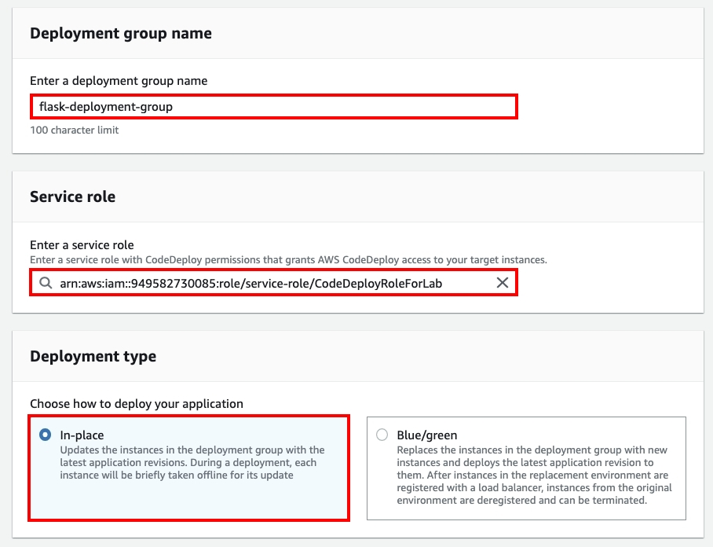
</p>

* For the **Environment configuration**:
  * select `Amazon EC2 instances`
    * **Key**: `Name`
    * **Value**: `flask-app`

<p style="text-align:center;">
    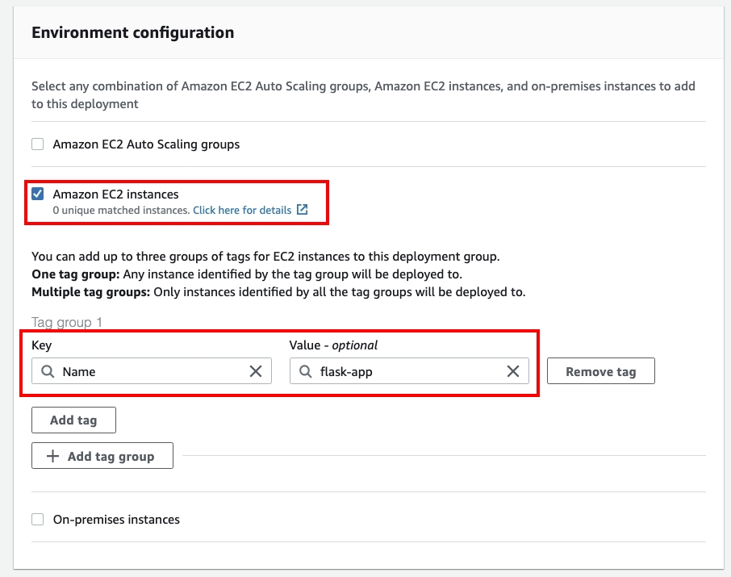
</p>

> This is a very important setting, using the above tag to select EC2 instance as the target of deployment.

* For the **Agent configuration with AWS Systems Manager**: `Never`.

* For the **Deployment settings**: `CodeDeployDefault.AllAtOnce`.

* For the **Load balancer**: *Unclick* **Enable load balancing**.

* Select **Create deployment group**.

## Task 4: Setup CICD Pipeline with CodePipeline

### Step 1: Create Pipeline

* Open the [CodePipeline](https://us-west-2.console.aws.amazon.com/codesuite/codepipeline/pipelines?region=us-west-2) console.

* Select **Create pipeline**.

* For the **Pipeline settings**:
  * **Pipeline name**: `flask-app`
  * **Service role**: `Existing service role`
  * **Role name**: `CodePipelineRoleForLab`
  * **Next**

<p style="text-align:center;">
    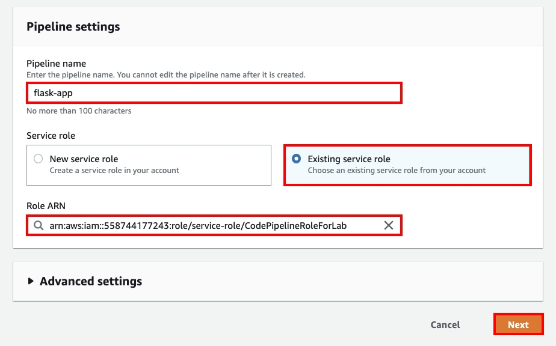
</p>

* For the **Source**:
  * **Source provider**: `AWS CodeCommit`
  * **Repository name**: `sample-flask-app`
  * **Branch name**: `master`
  * **Change detection options**: `AWS CodePipeline`
  * **Output artifact format**: `CodePipeline default`
  * **Next**

<p style="text-align:center;">
    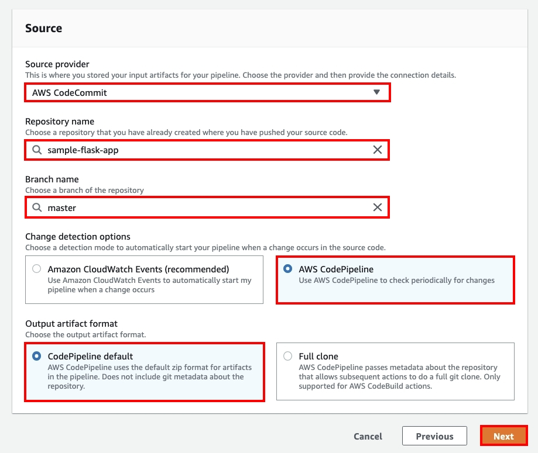
</p>

* Skip the **Build** stage.

<p style="text-align:center;">
    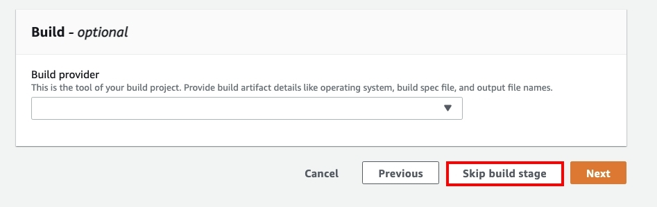
</p>

* For the **Deploy**:
  * **Deploy provider**: `AWS CodeDeploy`
  * **Region**: `US West(Oregon)`
  * **Application name**: `flask-app`
  * **Deployment group**: `flask-deployment-group`
  * **Next**

<p style="text-align:center;">
    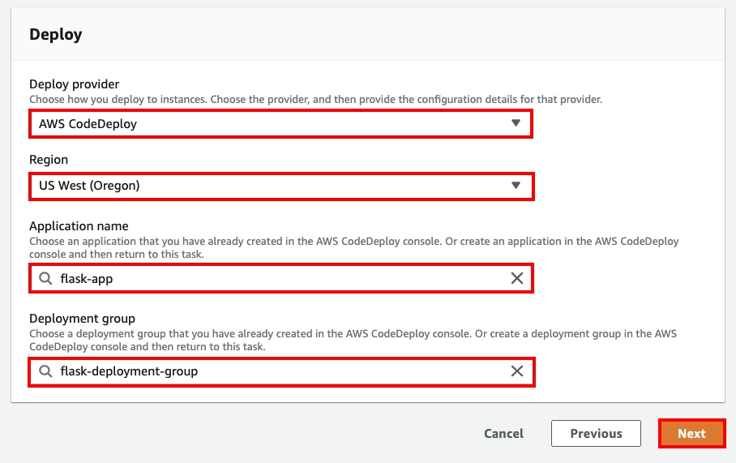
</p>

* Select **Create pipeline**.

* When CodeDeploy deploys from the source code in CodeCommit to EC2, you will see that the pipeline has been completed!

<p style="text-align:center;">
    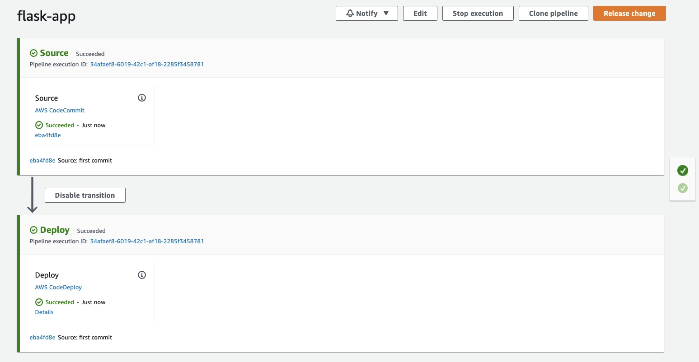
</p>

### Step 2: Verification results

* Open the [EC2](https://us-west-2.console.aws.amazon.com/ec2/v2/home?region=us-west-2#Instances:) console.

* Select the EC2 named `flask-app`.

* Copypaste the **Public IPv4 address** or **Public IPv4 DNS** to your browser.

<p style="text-align:center;">
    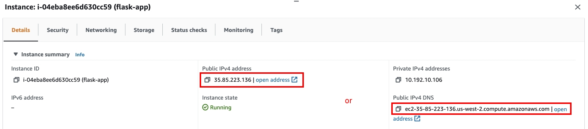
</p>

* You will see the website host by EC2.

<p style="text-align:center;">
    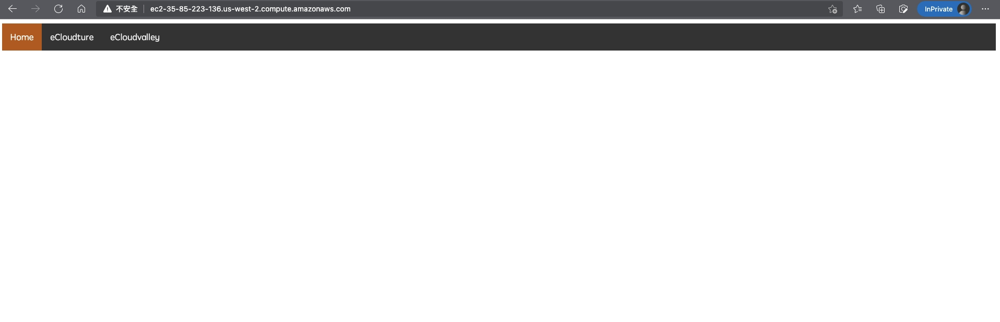
</p>

## Task 5: Update and Verify the Pipeline

* Go back to Cloud9 IDE.

* Double click `home.html` in `sample-flask-app/templates` folder

> `/home/ec2-user/environment/sample-flask-app/templates/home.html`

<p style="text-align:center;">
    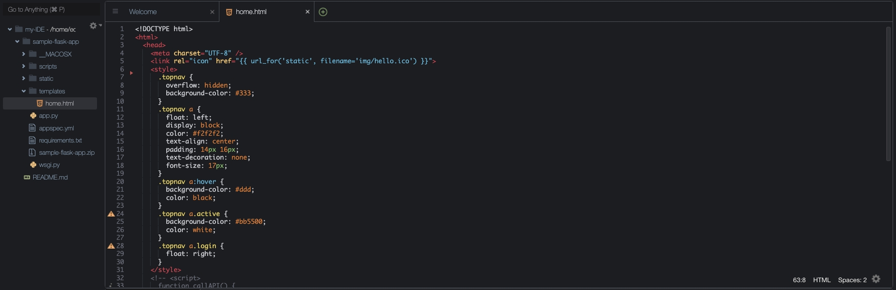
</p>

* Let's add background color to this page, copypaste the following style in `<style>` tag:

```css
body {
        margin: 0;
        background: -webkit-linear-gradient(left, #c3552f, #cd7233, #d88f3a);
        background: -moz-linear-gradient(left, #c3552f, #cd7233, #f19914);
        background: -o-linear-gradient(left, #c3552f, #cd7233, #f19914);
        background: linear-gradient(left, #c3552f, #cd7233, #f19914);
        background-position: center top;
        background-size: 100% auto;
      }
```

<p style="text-align:center;">
    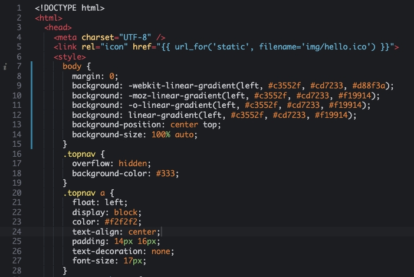
</p>

> Remeber to save the changes(`cmd+s` or `ctrl+s`).

* Type the following command to push the changes to CodeCommit.

```bash
$ git add .
git commit -m "add background color"
git push
```

* Back to the CodePipeline console, You will see that the newly updated content has been automatically deployed to EC2.

<p style="text-align:center;">
    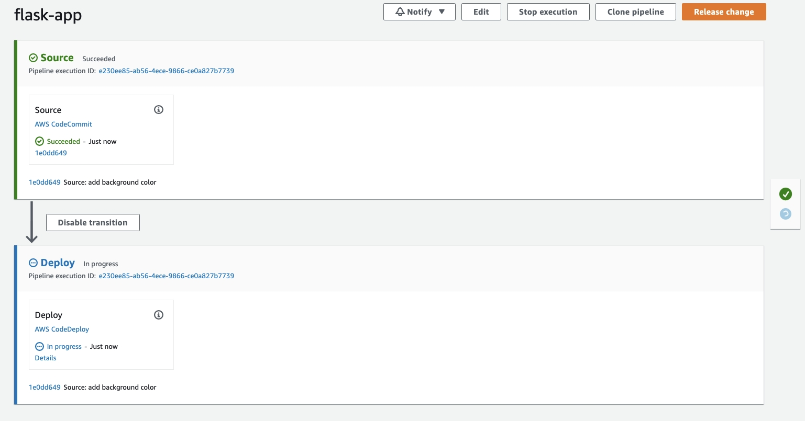
</p>

> Make sure all pipeline stages was *Succeeded*.

* Refresh the EC2 website, You will see `welcome` is displayed because the background color is changed.

<p style="text-align:center;">
    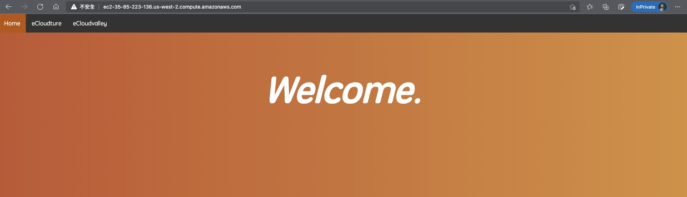
</p>

### Cleanup

To delete the AWS resources, perform the tasks below in order:

* Delete CodePipeline
* Delete CodeDeploy Application
* Delete CodeCommit Repository
* Delete Cloud9 Environment
* Terminate EC2 Instance

## Conclusion

Congratulations! You have learned how to :

* Use Cloud9 as IDE to develop the project
* Create CodeCommit as the code repository
* Use Codepipeline to integrate the CICD services